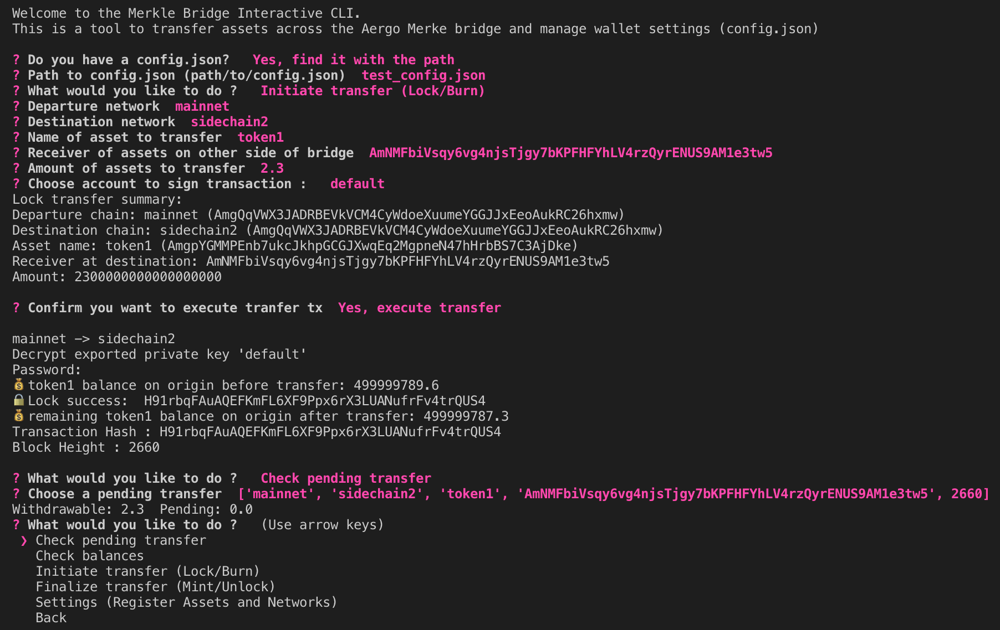

Using the Aergo CLI
======================
CLI for the proposer/validator
------------------------------
Start the cli:

.. code-block:: bash

    $ python3 -m aergo_cli.main

The first step is to create a config file or load an existing one

Then the main menu appears with cli functionalty:

These are the settings available from the cli

.. image:: images/step2.png

Creating a config file from scratch
^^^^^^^^^^^^^^^^^^^^^^^^^^^^^^^^^^^

Registering a new bridge
^^^^^^^^^^^^^^^^^^^^^^^^

.. image:: images/register_bridge.png

Updating bridge settings
^^^^^^^^^^^^^^^^^^^^^^^^

.. image:: images/t_anchor_update.png

If the new anchoring periode reached validator consensus, 
it can then be automatically updated in the bridge contract by the proposer.

.. code-block:: bash

    proposer: mainnet: "Anchoring periode update requested: 7"
    proposer: mainnet: "⌛ tAnchorUpdate success"

CLI for asset transfers
-----------------------

Registering a new asset in config file
^^^^^^^^^^^^^^^^^^^^^^^^^^^^^^^^^^^^^^

Transfering a registered asset
^^^^^^^^^^^^^^^^^^^^^^^^^^^^^^

Check pending transfers
^^^^^^^^^^^^^^^^^^^^^^^

It is possible to check withdrawable balances of pending transfer between chains.

If a transfer was made with the cli, the transfer parameters are recorded but it is also
possible to check the withdrawable balance of a custom transfer between any chain.
'Withdrawable' is the balance that can be immediatly withdrawn on the other side of the bridge.
'Pending' is the balance that was deposited in the bridge contract but the anchor has not 
happened on the other side of the bridge so it is not yet withdrawable.

Pending transfers are recorded as an array of [departure chain, destination chain, asset name, receiver, block height of lock/burn].
All pending transfer are store in cli/pending_transfers.json and deleted once finalized.