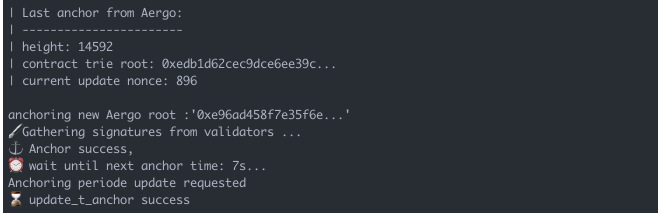

Proposer
========

A proposer connects to all validators and requests them to sign a new anchor 
with the GetAnchorSignature rpc request.
To prevent downtime, anybody can become a proposer and request signatures to validators.
It is the validator's responsibility to only sign correct anchors.
The bridge contracts will not update the state root if the anchoring time is not reached (t_anchor).

Starting a Proposer
--------------------

.. code-block:: bash

    $ python3 -m aergo_bridge_operator.proposer_client --help

        usage: proposer_client.py [-h] -c CONFIG_FILE_PATH --net1 NET1 --net2 NET2
                                [--privkey_name PRIVKEY_NAME] [--auto_update]

        Start a proposer between 2 Aergo networks.

        optional arguments:
        -h, --help            show this help message and exit
        -c CONFIG_FILE_PATH, --config_file_path CONFIG_FILE_PATH
                                Path to config.json
        --net1 NET1           Name of Aergo network in config file
        --net2 NET2           Name of Aergo network in config file
        --privkey_name PRIVKEY_NAME
                                Name of account in config file to sign anchors
        --auto_update         Update bridge contract when settings change in config
                                file

    $ python3 -m aergo_bridge_operator.proposer_client -c './test_config.json' --net1 'mainnet' --net2 'sidechain2' --privkey_name "proposer" --auto_update

        ------ Connect AERGO -----------
        ------ Connect to Validators -----------
        Validators:  ['AmNLjcxUDmxeGZL7F8bqyaGt3zqog5HAoJmFBEZAx1RvfTKLSBsQ', 'AmNLjcxUDmxeGZL7F8bqyaGt3zqog5HAoJmFBEZAx1RvfTKLSBsQ', 'AmNLjcxUDmxeGZL7F8bqyaGt3zqog5HAoJmFBEZAx1RvfTKLSBsQ']
        sidechain2 (t_final=4) -> mainnet  : t_anchor=6
        ------ Set Sender Account -----------
        Decrypt exported private key 'proposer'
        Password: 
        > Proposer Address: AmPxVdu993eosN3UjnPDdN3wb7TNbHeiHDvn2dvZUcH8KXDK3RLU
        ------ Connect AERGO -----------
        ------ Connect to Validators -----------
        Validators:  ['AmNLjcxUDmxeGZL7F8bqyaGt3zqog5HAoJmFBEZAx1RvfTKLSBsQ', 'AmNLjcxUDmxeGZL7F8bqyaGt3zqog5HAoJmFBEZAx1RvfTKLSBsQ', 'AmNLjcxUDmxeGZL7F8bqyaGt3zqog5HAoJmFBEZAx1RvfTKLSBsQ']
        mainnet (t_final=5) -> sidechain2  : t_anchor=7
        ------ Set Sender Account -----------
        Decrypt exported private key 'proposer'
        Password: 
        > Proposer Address: AmPxVdu993eosN3UjnPDdN3wb7TNbHeiHDvn2dvZUcH8KXDK3RLU

                                                | Last anchor from mainnet:
                                                | --------------------------
                                                | height: 3263
                                                | contract trie root: 0x0b714c1ea74bee1bd...
                                                | current update nonce: 374

        | Last anchor from sidechain2:
        | --------------------------
        | height: 3263
        | contract trie root: 0x25512cabc208ac5f8...
        | current update nonce: 437

        anchoring new root :'0x84e73f87607b39196...'
        🖋 Gathering signatures from validators ...
                                                anchoring new root :'0xdc36b3b3fd7d57c51...'
                                                🖋 Gathering signatures from validators ...
                                                ⚓ Anchor success,
                                                ⏰ wait until next anchor time: 7s...
        ⚓ Anchor success,
        ⏰ wait until next anchor time: 6s...

.. code-block:: python

    from aergo_bridge_operator.proposer_client import BridgeProposerClient

    proposer = BridgeProposerClient("./test_config.json", 'mainnet', 'sidechain2')
    proposer.run()

Updating bridge settings
------------------------

Bridge settings are updated when the config file changes and the proposer is started with --auto_update
The proposer will then try to gather signatures from validators to make the update on chain.

.. image:: images/t_anchor_update.png

If the new anchoring periode reached validator consensus, 
it can then be automatically updated in the bridge contract by the proposer.

