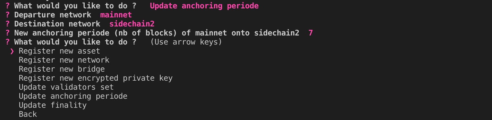

Validator
=========

A validator will sign any state root from any proposer via the GetAnchorSignature rpc request as long as it is valid.
Therefore a validator must run a full node.
Assets on the sidechain are secure as long as 2/3 of the validators validate both chains and are honnest.
Since signature verification only happens when anchoring (and not when transfering assets), 
the number of validators can be very high as the signature verification cost is necessary only once per anchor.

Starting a Validator
--------------------

.. code-block:: bash

    $ python3 -m aergo_bridge_operator.validator_server --help

        usage: validator_server.py [-h] -c CONFIG_FILE_PATH --net1 NET1 --net2 NET2 -i
                                VALIDATOR_INDEX [--privkey_name PRIVKEY_NAME]
                                [--auto_update] [--local_test]

        Start a validator between 2 Aergo networks.

        optional arguments:
        -h, --help            show this help message and exit
        -c CONFIG_FILE_PATH, --config_file_path CONFIG_FILE_PATH
                                Path to config.json
        --net1 NET1           Name of Aergo network in config file
        --net2 NET2           Name of Aergo network in config file
        -i VALIDATOR_INDEX, --validator_index VALIDATOR_INDEX
                                Index of the validator in the ordered list of
                                validators
        --privkey_name PRIVKEY_NAME
                                Name of account in config file to sign anchors
        --auto_update         Update bridge contract when settings change in config
                                file
        --local_test          Start all validators locally for convenient testing 

    $ python3 -m aergo_bridge_operator.validator_server -c './test_config.json' --net1 'mainnet' --net2 'sidechain2' --validator_index 1 --privkey_name "validator" --auto_update

        ------ Connect AERGO -----------
        Bridge validators :  ['AmNLjcxUDmxeGZL7F8bqyaGt3zqog5HAoJmFBEZAx1RvfTKLSBsQ', 'AmNLjcxUDmxeGZL7F8bqyaGt3zqog5HAoJmFBEZAx1RvfTKLSBsQ', 'AmNLjcxUDmxeGZL7F8bqyaGt3zqog5HAoJmFBEZAx1RvfTKLSBsQ']
        mainnet             <- sidechain2 (t_final=4) : t_anchor=6
        mainnet (t_final=5) -> sidechain2              : t_anchor=7
        WARNING: This validator will vote for settings update in config.json
        ------ Set Signer Account -----------
        Decrypt exported private key 'validator'
        Password: 
        > Validator Address: AmNLjcxUDmxeGZL7F8bqyaGt3zqog5HAoJmFBEZAx1RvfTKLSBsQ
        server 1  started
                MAINNET                         SIDECHAIN
                                                ⚓ Validator 1 signed a new anchor for sidechain,
                                                with nonce 376
        ⚓ Validator 1 signed a new anchor for mainnet,
        with nonce 439

.. code-block:: python

    from aergo_bridge_operator.validator_server import ValidatorServer

    validator = ValidatorServer("./test_config.json", 'mainnet', 'sidechain2')
    validator.run()

Updating bridge settings
------------------------

The information (validator set, anchoring periods, finality of blockchains) contained in the config file
will be used by the validator to vote on changes if --auto_update is enabled.
Be careful that the information in config file is correct as any proposer can request a signature of that information.
If the proposer gathers 2/3 signatures for the same information them the bridge settings can be updated.

